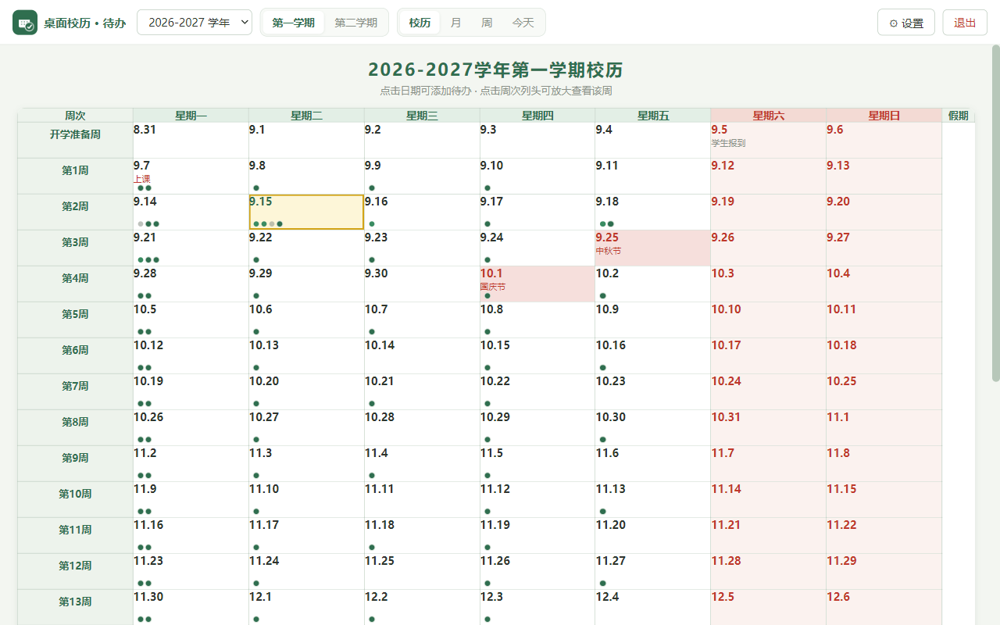
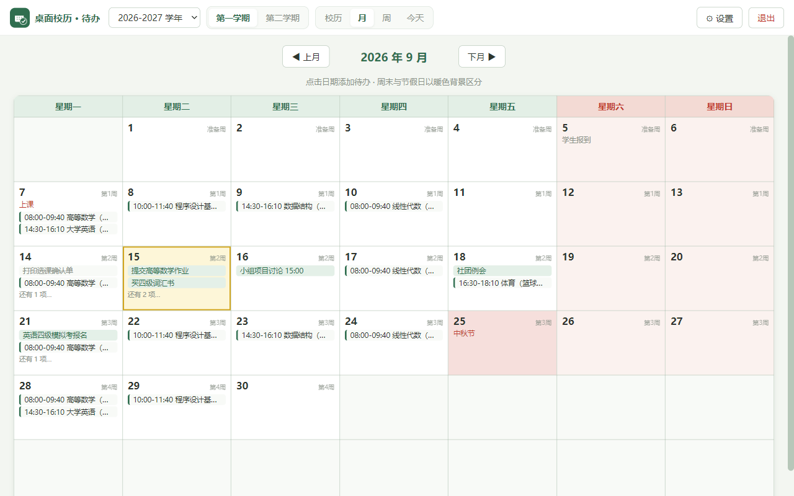
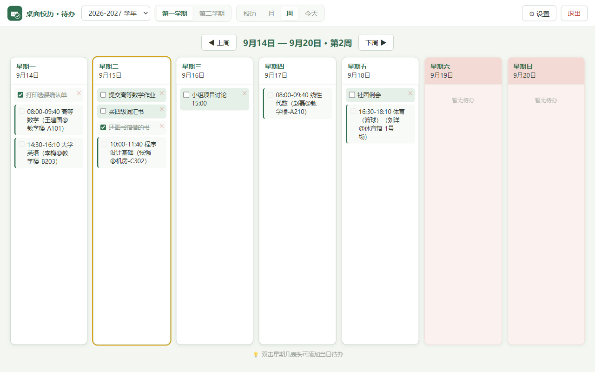
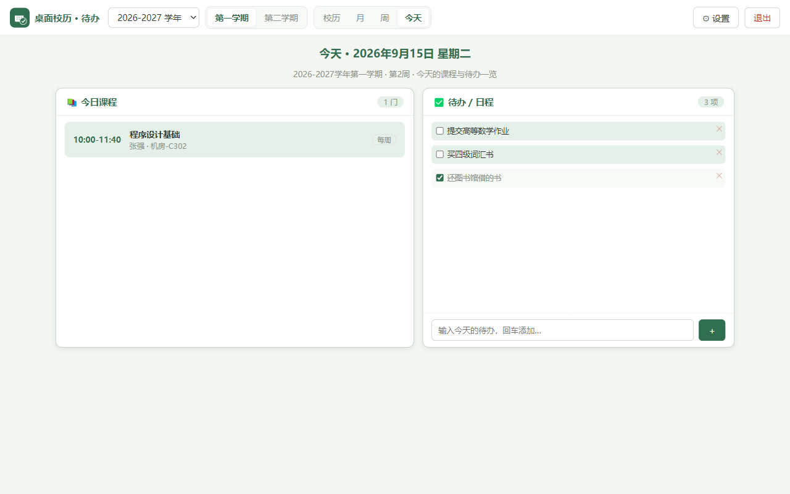
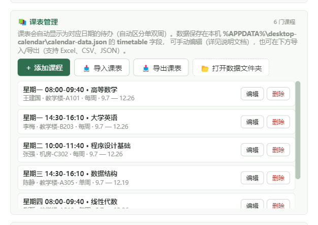

# 桌面校历 · 待办（Desktop Calendar）

<p align="center"></p>

面向高校场景的桌面日历工具：以「学年校历」为核心（周次网格 + 学期事件），整合课表课程与待办事项。基于 Electron 构建，完全离线使用，数据保存在本机。

## 功能一览

- **四种视图**：「校历 / 月 / 周 / 今天」一键切换 —— 校历总览一学年，月视图看全月，周视图做周计划，“今天”只看当天课程与待办；
- **课表管理**：课程的新增 / 修改 / 删除；支持从 **Excel（兼容常见教务系统导出格式）/ CSV / JSON** 导入与导出；自动按「星期 + 单双周 + 起止日期」把课程映射到每一天；
- **待办事项**：点击任意日期格子添加；**双击周视图表头**快速添加当天待办；支持完成勾选、删除，月 / 周 / 今天视图同步显示；
- **校历编辑**：每学年两个学期，开学准备周、上课周数、考试周数、节假日事件、备注均可自定义；顶部「＋ 新建下一学年」一键推算新学年；
- **桌面壁纸模式**：把校历钉在桌面壁纸层——半透明卡片、不占任务栏、其他窗口正常盖在其上；透明度 30%~100% 可调；
- **外观主题**：内置 5 款配色（经典雅蓝 / 青竹书苑 / 秋杏暖阳 / 樱粉随笔 / 墨夜静读）；
- **可选：印象笔记同步**：填入自己的印象笔记开发者 Token 后，可与待办双向同步（不配置不影响任何功能）；
- 数据完全存储在本机（`%APPDATA%\desktop-calendar\calendar-data.json`），可备份、可迁移、可手动编辑。

## 下载安装（普通用户）

前往 [Releases](https://github.com/wcaijun/desktop-calendar/releases) 页面下载最新版本：

| 文件 | 适用 | 说明 |
|------|------|------|
| `桌面校历-Setup-*.exe` | Windows | **安装版**：双击安装，可自选安装目录，自动创建桌面快捷方式（推荐） |
| `桌面校历-便携版-*.exe` | Windows | **免安装版**：下载后双击直接用 |
| `DesktopCalendar-*-linux-x64.tar.gz` | Linux | **免安装版**：解压后运行其中的 `desktop-calendar` 程序 |
| `DesktopCalendar-*-linux-x64.AppImage` | Linux | 免安装单文件版：`chmod +x` 后双击运行（由自动构建生成） |
| `使用说明.html` | 通用 | 图文使用手册（含截图） |
| `示例课表模板.xlsx` | 通用 | 示例课表：在「课表管理 → 导入课表」中选它，即可体验课表导入 |

> Windows 首次运行若出现 SmartScreen 提示（「Windows 已保护你的电脑」），点击「更多信息」→「仍要运行」即可——本软件免费开源、未购买代码签名证书，属正常现象。
> **macOS 用户**：给仓库推送一个版本标签（如 `v1.1.1`）后，仓库内置的自动构建会在云端生成 macOS 版并出现在 Releases（Windows / Linux 版本也会同步生成）。

## 快速上手

1. 打开安装版或便携版；
2. 「校历设置 → 课表管理」导入你的课表（Excel / CSV / JSON；想先体验可以下载 `示例课表模板.xlsx` 直接导入），或手动添加第一门课；
3. 点击日期格子添加待办；周视图里**双击「星期X」表头**快速添加当天待办。

更完整的图文教程见 [使用说明.md](使用说明.md)。

## 截图









> 截图均为**示例数据**（内置示例课表，与实际学校无关），用于演示界面效果。

## 数据存储

| 内容 | 位置 |
|------|------|
| 全部数据（校历 / 课表 / 待办 / 设置） | `%APPDATA%\desktop-calendar\calendar-data.json` |
| 自动留档（每次保存前生成） | 同目录 `calendar-data.backup.json` |

也可以在应用内直达：「校历设置 → 课表管理 → 打开数据文件夹」。**备份或换电脑：复制该数据文件即可。**

课表的字段格式与手动修改方法：见 [使用说明.md](使用说明.md) 中的「课表数据与手动修改」一节。

## 从源码运行（开发者）

```bash
npm install
npm start
```

> Windows 下建议双击项目根目录的 `start-calendar.vbs` 启动，无控制台窗口。
> 国内网络可使用镜像安装：`npm install --registry=https://registry.npmmirror.com --electron_mirror=https://npmmirror.com/mirrors/electron/`

打包安装文件（NSIS 安装版 + 便携版，输出到 `dist/`）：

```bash
npm run dist
```

## 常见问题

- **SmartScreen / 杀毒软件提示**：未签名开源软件的常见提示，选择「仍要运行」或添加信任即可；
- **数据会丢吗**：每次保存前都会自动留一份 `calendar-data.backup.json`；也可以随时手动备份数据文件；
- **支持 Mac / Linux 吗**：目前仅提供 Windows 64 位发行版；技术栈本身跨平台，可自行适配；
- **课表导入**：与常见教务系统导出的 Excel 兼容（支持中文表头：课程名称、教师姓名、星期、单双周、上课时间、起始时间、结束时间、场地名称等），详细说明见 [使用说明.md](使用说明.md)。

## 目录结构

```
desktop-calendar/
├── main.js                  # Electron 主进程：窗口、数据读写、文件对话框
├── preload.js               # contextBridge 安全暴露的桥接接口
├── renderer/
│   ├── index.html           # 界面骨架
│   ├── style.css            # 全部样式（含 5 款主题与桌面模式）
│   ├── app.js               # 数据模型 + 四视图渲染 + 待办 / 课表逻辑
│   ├── evernote-sync.js     # 可选：印象笔记同步引擎
│   └── logo.png             # 应用图形标识
├── build/icon.ico           # 打包用应用图标
├── docs/screenshots/        # 文档截图
├── 使用说明.md               # 面向普通用户的图文使用手册
├── 示例课表模板.xlsx         # 示例课表（导入体验用）
├── CHANGELOG.md             # 更新日志
├── .github/workflows/       # 自动构建（Windows / macOS / Linux 安装包）
└── LICENSE                  # MIT
```

## 更新日志

见 [CHANGELOG.md](CHANGELOG.md)。

## 开源协议

[MIT](LICENSE)
