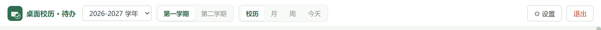
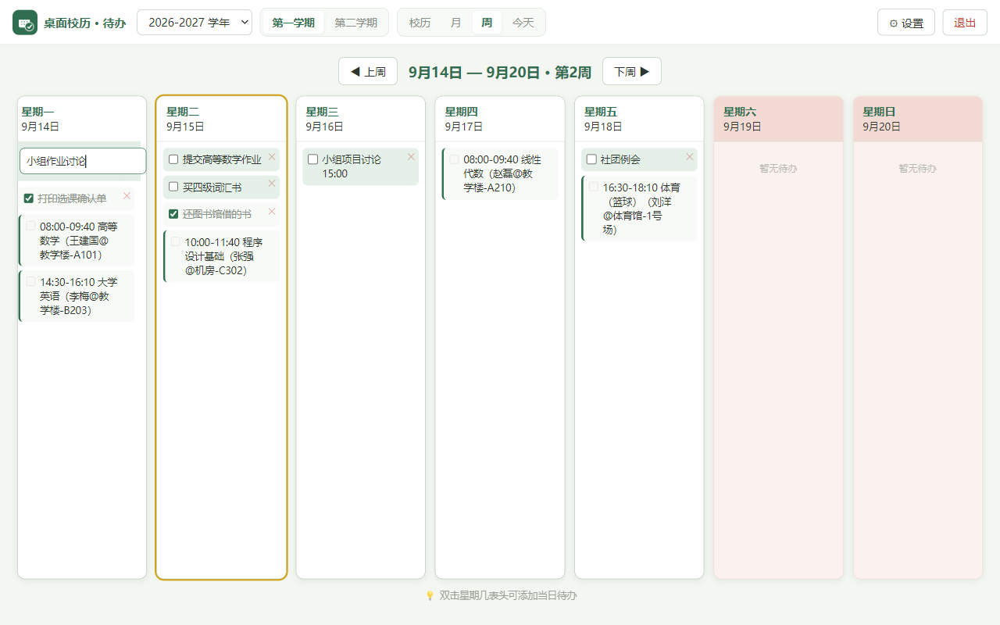

# 桌面校历 · 待办 — 使用说明（Windows）

> 面向第一次使用的朋友：照着本文做就能完成安装和日常使用，不需要任何电脑基础。
> 文中截图为示例数据，仅用于演示界面效果。

## 一、下载

1. 打开项目主页：<https://github.com/wcaijun/desktop-calendar>
2. 点击右侧的 **Releases**（发行版），或直接访问
   <https://github.com/wcaijun/desktop-calendar/releases>
3. 在最新版本的 **Assets** 区域下载：
   - **安装版**：`桌面校历-Setup-x.x.x.exe`（推荐）
   - **免安装版**：`桌面校历-便携版-x.x.x.exe`
   - （可选）`使用说明.html`：离线版图文说明
   - （可选）`示例课表模板.xlsx`：想先体验课表导入，可以下载它
   - **Linux 用户**：下载 `DesktopCalendar-*-linux-x64.tar.gz`，解压后运行其中的 `desktop-calendar` 程序

## 二、安装（约 1 分钟）

**安装版（推荐）**

1. 双击下载好的 `桌面校历-Setup-x.x.x.exe`；
2. 如果出现蓝色提示「Windows 已保护你的电脑」：
   点「**更多信息**」→「**仍要运行**」。
   （这是因为软件未购买付费的代码签名证书，属正常现象，可放心使用）
3. 按提示点「下一步」完成安装（安装位置可自选）；
4. 安装完成后桌面会出现「桌面校历」图标，双击打开即可。

**免安装版**

- 下载后双击 `桌面校历-便携版-x.x.x.exe` 直接打开使用；
- 建议：右键该文件 →「发送到」→「桌面快捷方式」，方便以后打开。

## 三、界面速览

- 顶部左侧：**学年**下拉、**第一学期 / 第二学期**切换、「**校历 / 月 / 周 / 今天**」四个视图；
- 顶部右侧：「**设置**」和「**退出**」。

**校历视图**：一学年的总览（两个学期分开展示），红字为节假日事件。

**月视图**：看全月，每天的课程与待办一目了然。

## 四、日常使用

### 1. 添加待办

- **月 / 校历视图**：点击任意日期格子 → 输入内容 → 回车；
- **周视图**：**双击「星期X」表头** → 下方出现输入框 → 输入 → 回车：

- **今天视图**：右侧「待办 / 日程」底部输入框直接输入。

### 2. 完成 / 删除待办

- 点待办前的小方框 = 标记完成（会显示划线）；
- 点「×」= 删除。

### 3. 查看今天

点顶部「**今天**」：左边是今天的课（按时间排序），右边是今天的待办 / 日程：

### 4. 导入我的课表（课表管理）

1. 点「**设置 → 课表管理**」；
2. 点「**导入课表**」选择文件（支持 Excel / CSV / JSON，兼容常见教务系统导出的 Excel 表头；想先试一下，可以直接导入仓库里的《示例课表模板.xlsx》）；
   - 注意：导入会**替换**当前全部课表，导入前可先点「导出课表」备份；
3. 也可以点「**＋ 添加课程**」手动一门一门添加；
4. 添加 / 修改 / 删除后立即生效，无需其他操作。

### 5. 桌面壁纸模式（可选）

「设置 → 外观与桌面」中打开**桌面模式**并调节不透明度：校历会变成贴在桌面上的半透明卡片，不占任务栏、不影响其他软件使用。

## 五、我的数据存在哪里 / 怎么备份

- 所有数据（校历、课表、待办、设置）都保存在一个文件里：

  `C:\Users\<你的用户名>\AppData\Roaming\desktop-calendar\calendar-data.json`

- 应用内直达：**「设置 → 课表管理 → 打开数据文件夹」**；
- **备份**：把 `calendar-data.json` 复制到别处保存即可；
- **恢复 / 换电脑**：把备份文件放回上面这个位置；
- 每次保存前，应用会自动把上一版留档为同目录的 `calendar-data.backup.json`。

## 六、课表数据格式（进阶：需要手动修改时看）

课表存放在数据文件的 `"timetable"` 字段（一个数组，每门课一条）：

| 字段 | 含义 | 取值 | 必填 |
|------|------|------|------|
| `course` | 课程名称 | 文本 | 是 |
| `dayNum` | 星期几 | 1~7（1=周一） | 是 |
| `time` | 上课时间 | 如 `14:30-16:10` | 建议 |
| `weekKind` | 周类型 | `每周` / `单周` / `双周` | 否（默认每周） |
| `startDate` / `endDate` | 起止日期 | `YYYY-MM-DD`，缺省为长期有效 | 否 |
| `teacher` / `room` | 教师 / 地点 | 文本 | 否 |
| 其他 | building / major / klass / grade / courseType / college | 备注信息 | 否 |

> 手动修改前先退出应用；改完保存后重新打开即可生效。改坏了也不要紧：用 `calendar-data.backup.json` 还原，或删除数据文件重新开始。

## 七、常见问题

- **打开时提示「Windows 已保护你的电脑」？** 点「更多信息 → 仍要运行」，正常现象；
- **杀毒软件提示？** 属于未签名开源软件的常见误报，添加信任即可；
- **数据会丢吗？** 每次保存前自动留档；平时也可以自己复制数据文件做备份；
- **怎么更新到新版本？** 到 Releases 页面下载新版安装包，直接安装即可（原有数据不受影响）；
- **支持 Mac / Linux 吗？** Linux 提供 AppImage / tar.gz 版本；macOS 可通过仓库的自动构建获取（给仓库推一个版本标签即可在 Releases 看到）。
- **怎么卸载？** 安装版：「设置 → 应用 → 已安装的应用」里卸载；免安装版：直接删除文件即可。
